

## Welcome!

Please introduce yourself:

- Name
- Organization/Institution
- Why are you here?

## {.smaller style="margin-top: -60px;"}

:::: {.columns}

{width="100%" fig-align="center"}

::: {.column width="70%"}

**Celebrating 35+ years: 501(c)3 nonprofit organization**

**Our Mission**: A transformative, collaborative community empowering educators to drive innovation in STEM education for all students. We provide unique professional development opportunities for faculty and future faculty, extensive support for a wide range of joint projects, and a community that has the broad aim of student success in STEM. We work together to foster the continued development of each member of the community and to promote their success.
:::

::: {.column width="30%"}

:::

::::

## QUBES {.smaller}

:::: {.columns}

::: {.column width="30%"}

[https://qubeshub.org](https://qubeshub.org)

- OER Resource Library
- Project Workspaces
- Education Project Websites


:::

::: {.column width="70%"}
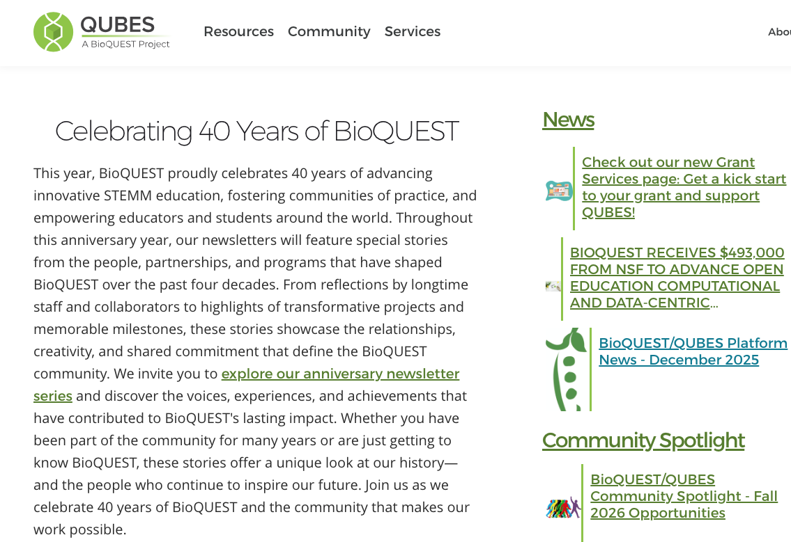{style="border:2px solid;"}
:::

::::

## OEE-RCN {.smaller}

:::: {.columns}

::: {.column width="50%"}

**The Open Education Ecosystem Research Coordination Network**

We will establish, incubate, and sustain an Open Education Ecosystem (OEE) designed to address the complex landscape faculty face when adopting computational and data-centric technologies for teaching and learning biology.

| Sam Donovan | M. Drew LaMar | Deb Rook |
|:------:|:------:|:------:|
|{width=1in}|{width=1in}|{width=1in}|

: { .smaller .borderless }

:::

::: {.column width="50%"}
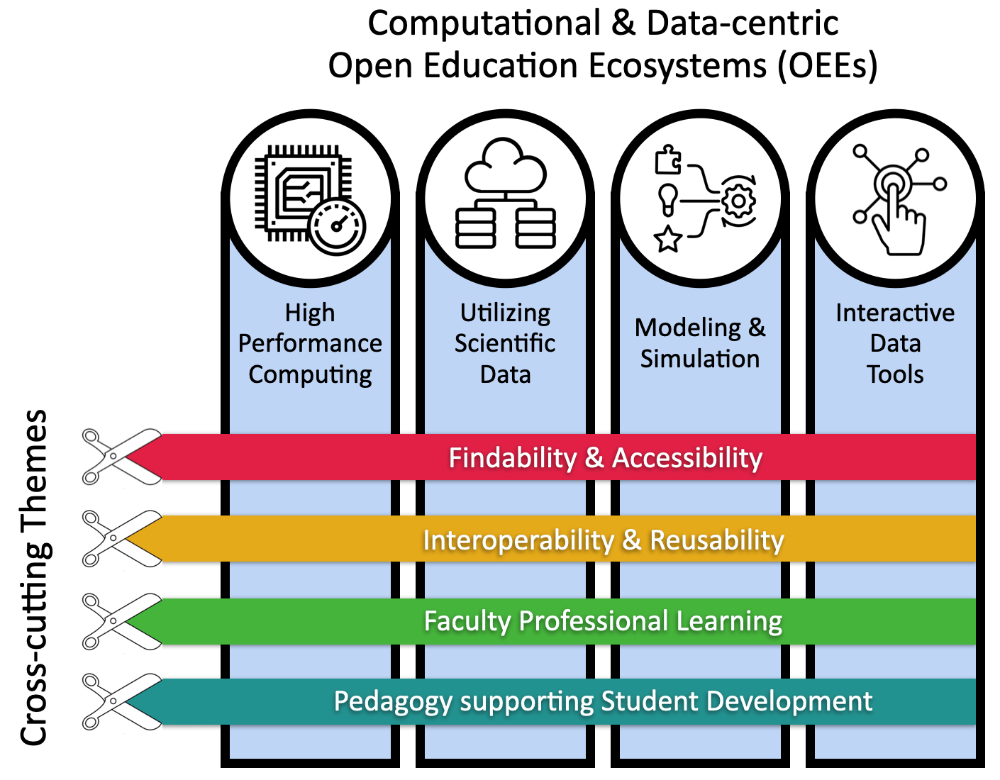

<center>
<https://oee.qubeshub.org>


[Grant #2418329](https://www.nsf.gov/awardsearch/showAward?AWD_ID=2418329)
</center>

:::

::::

## The (STEM) Open Education Ecosystem {.smaller}

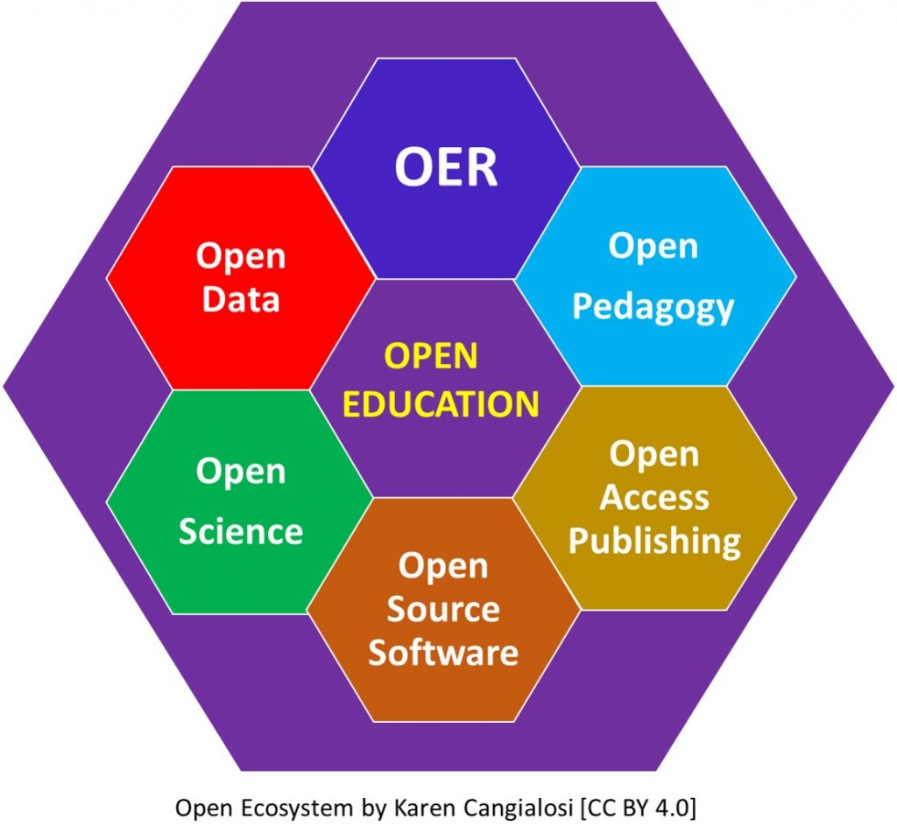{fig-align="center"}

## The OER Lifecycle

:::: {.columns}

::: {.column width="50%"}
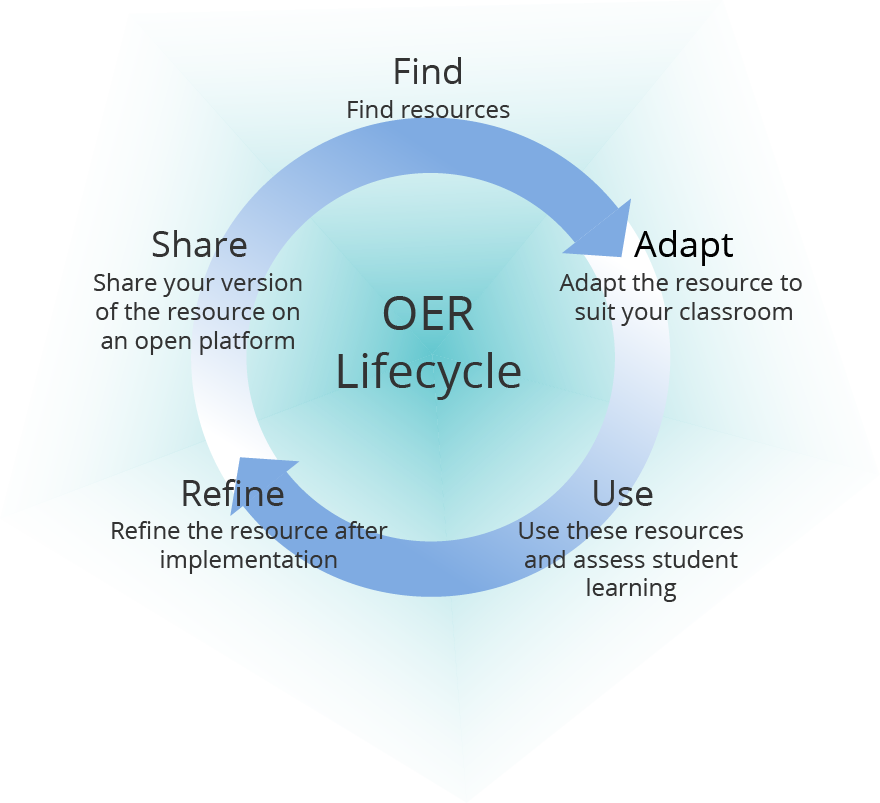{fig-align="center"}
:::

::: {.column width="50%"}

. . .

**Challenges:**

::: {.incremental}

- Finding resources is the "easy" part
- Many resources are not modifiable
- Very few modified resources are shared back
:::

:::

::::

## The Anatomy of an "Open" Resource

Three rows

 - Resource Type (Book, Lab, Lecture, Assignment, ...)
 - Resource Format (PDF, DOCX, HTML, ...)
 - Authoring (+Publishing) Platforms (LearnGala, OERCommons (Open Author), Pressbooks, Manifold, Quarto, PreTeXt/Plus, ...)

##  {background-image="images/quarto.png"}

## Introduction to Quarto

::: incremental
- The next evolution of R Markdown
- A publishing system for R, Python, and more
- Creates notebooks, dashboards, books, reports, presentations
:::

::: aside
quarto.org/
:::

::: notes
Quarto is a next-generation, open-source publishing system. It has expanded upon R Markdown to add new languages and can add more in the future. R Markdown has a lot of packages doing lots of different things, but Quarto has a shared expression for core features. Create dynamic content with Python, R, Julia, and Observable. Enable “single-source publishing” — create Word, PDFs, HTML, etc. from one source, you can make books, websites, presentations. There are many resources about Quarto, I gave a talk at R-Ladies St. Louis, and happy to link, but will only be sharing most critical aspects.
:::

## Quarto examples

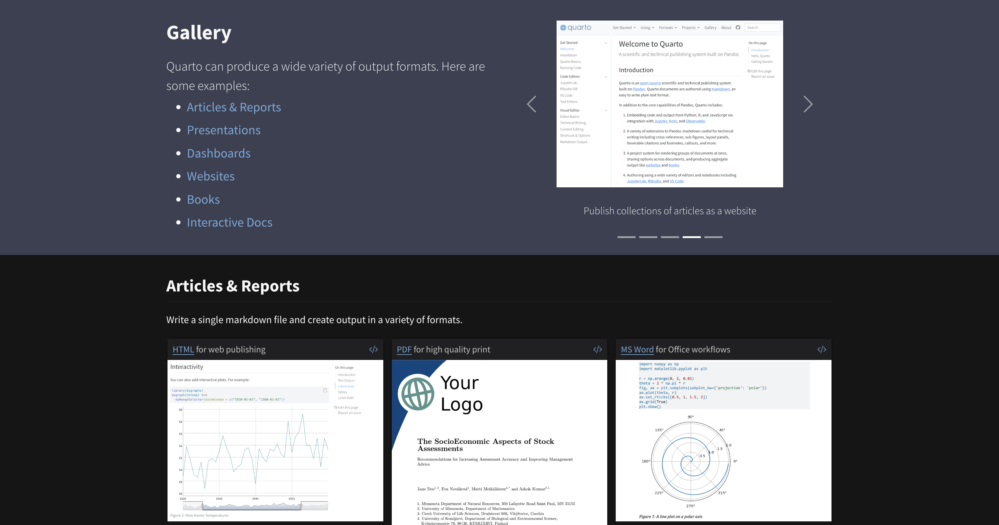{width="80%" fig-align="center"}

::: aside
[Link](https://quarto.org/docs/gallery/)
:::

## Anatomy of a Quarto document

::: r-stack
```` {.qmd code-line-numbers="|1-6|8,10|12|13-16|18-31"}
---
title: "ggplot2 demo"
format: 
  html:
    code-fold: true
---

## Meet Quarto

Quarto enables you to weave together content and executable code into a finished document. To learn more about Quarto see <https://quarto.org>.

```{{r}}
#| label: plot-penguins
#| echo: false
#| message: false
#| warning: false

library(tidyverse)
library(palmerpenguins)

ggplot(penguins, 
       aes(x = flipper_length_mm, y = bill_length_mm)) +
  geom_point(aes(color = species, shape = species)) +
  scale_color_manual(values = c("darkorange","purple","cyan4")) +
  labs(
    title = "Flipper and bill length",
    subtitle = "Dimensions for penguins at Palmer Station LTER",
    x = "Flipper length (mm)", y = "Bill length (mm)",
    color = "Penguin species", shape = "Penguin species"
  ) +
  theme_minimal()
```
````

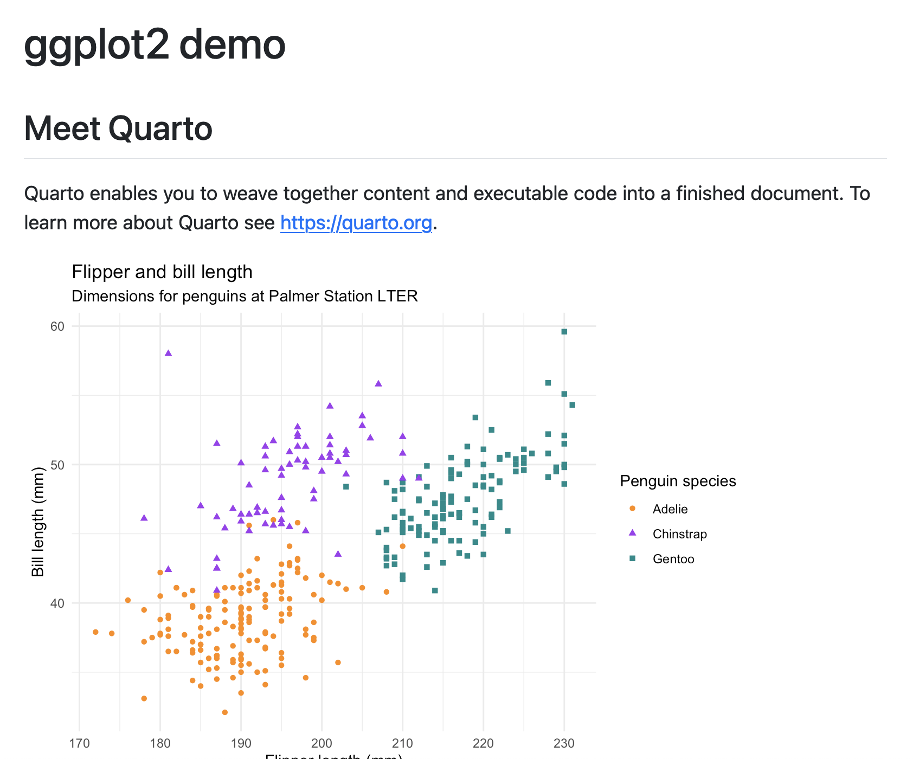{.fragment fig-align="center" width="50%"}
:::

## Quarto extensions

::: panel-tabset
## Formats

{width="40%" fig-align="center"}

Scrollytelling extension

## Journal articles

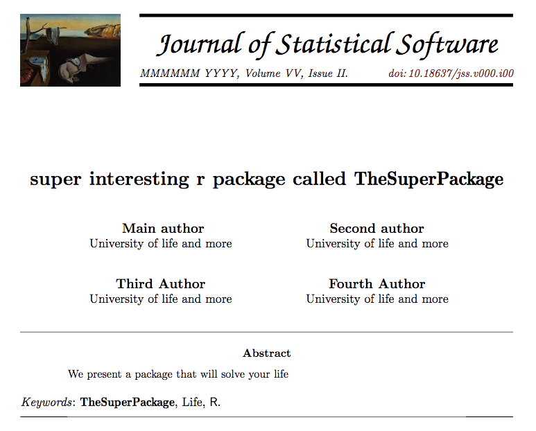{width="40%" fig-align="center"}

Journal of Statistical Software (JSS)

## RevealJS themes

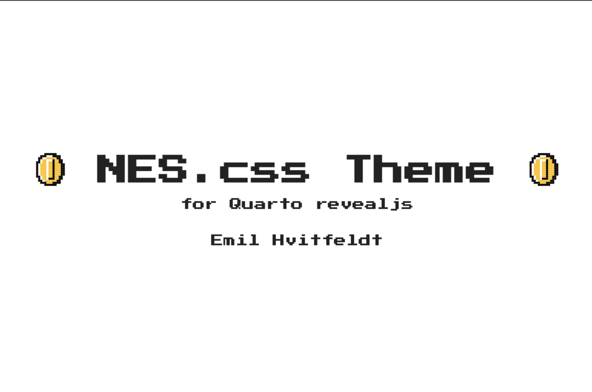{width="40%" fig-align="center"}

nes-revealjs format by EmilHvitfeldt
:::

::: notes
Quarto extensions let you customize and extend Quarto’s functionality beyond its built-in features. They enable: New Output Formats – Create custom templates for reports, presentations, or interactive documents, Custom Layouts & Themes – Design unique styling and layouts for HTML, PDF, or Word outputs. Custom Shortcodes & Filters – Modify how Quarto processes content, such as adding new syntax or automating formatting, which I will show in next page. Quarto has a Lua-based extension system, and you can make your own, too.
:::

## Quarto extensions

For example, there's a [fontawesome](https://github.com/quarto-ext/fontawesome) extension.

Install the extension:

``` {.bash filename="Terminal"}
quarto add quarto-ext/fontawesome
```

Add to your Quarto document YAML heading:

``` {.qmd filename="example.qmd" code-line-numbers="6,7"}
---
title: "ggplot2 demo"
format: 
  html:
    code-fold: true
    filters:
      - fontawesome
---
```

## Quarto extensions

Use the extension in the doc:

``` md
{}
```

Results in:



## Quarto extensions

Quarto extension gallery by Mickaël Canouil

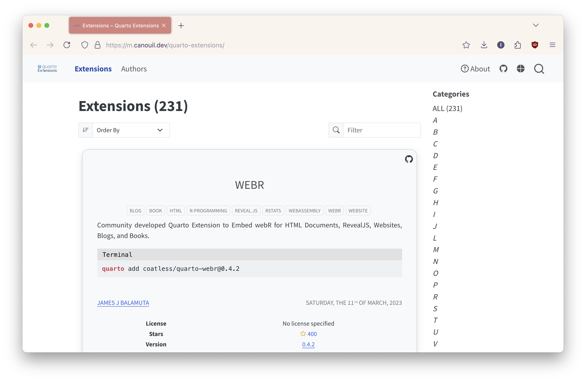{width="80%" fig-align="center"}

::: aside
[Link](https://m.canouil.dev/quarto-extensions/)
:::

## Hands-on activity

[Getting Started with Quarto](../../start.qmd)

##  {background-image="images/interactive.png"}

::: notes
Enter the world of interactive R and Python in the browser. Running code directly in the browser opens the door for many new and exciting uses for data science on the web.
:::

## Example: Interactive R console

[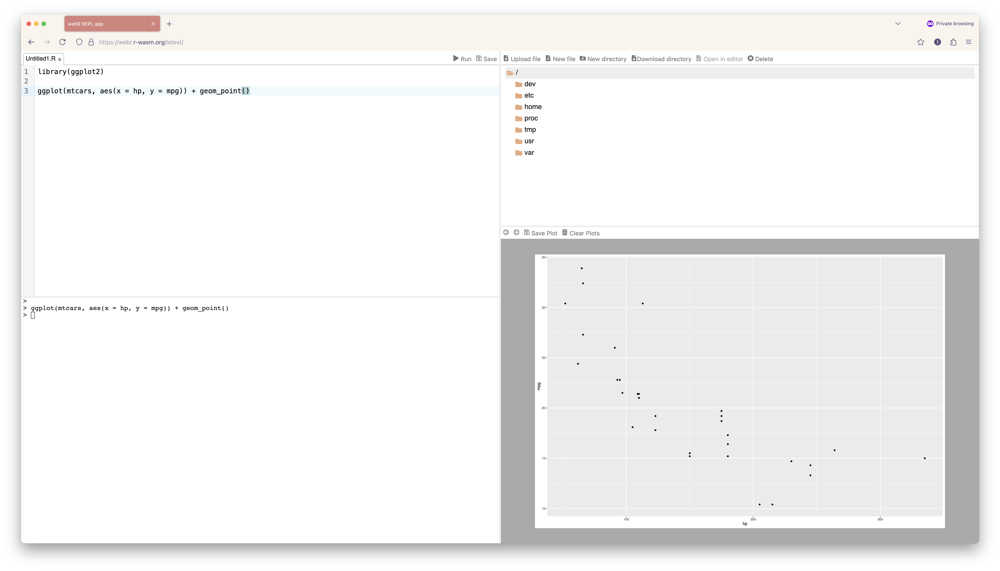{width="80%" fig-align="center"}](https://webr.r-wasm.org/latest/)

::: aside
[https://webr.r-wasm.org/latest/](https://webr.r-wasm.org/latest/)
:::

::: notes
For example, this is a web-based interactive R console that is included in the webR source repo as a demonstration of integrating webR in a wider web application. It provides a simple R environment in your web browser and includes console input/output, code editing, file management, and graphics device output.
:::

##  {background-image="images/webr-pyodide.png"}

::: notes
This is thanks to the amazing technology brought to you by webR and Pyodide. But first, let's talk about WebAssembly.
:::

## What is WebAssembly? {background-image="images/wasm.png"}

WebAssemby is a low-level, high-performance binary instruction format that allows code to run in web browsers.

::: notes
WebAssemby, or Wasm, is a low-level, high-performance binary instruction format that allows compiled languages like C and C++ to run in web browsers at near-native speeds. C and C++ code is compiled by something called Emscripten. Emscripten takes the C/C++ code as input, produces Wasm as a result. Once it's in Wasm, you can run it in any browser that supports Wasm, which in modern browsers, is most of them.
:::

##  {background-image="images/pyodide.png"}

::: notes
Python has had a browser solution for a while. Pyodide compiles the Python interpreter CPython to WebAssembly using Emscripten, making it possible to run Python in the browser.
:::

##  {background-image="images/webr.png"}

::: notes
Now, R has a similar solution with webR! WebR is the WebAssembly version of R that has been compiled to run in the browser. It's an open-source project primarily driven by Posit, and thanks to the amazing work of many folks but especially George Stagg and Lionel Henry, it is possible to run R code directly in a web browser without the need for traditional servers to execute the code. A user can visit a website and run R code directly without R installed on their device. All that is required is a web server such as GitHub Pages or Netlify.
:::

::: notes
For example, this is a web-based interactive R console that is included in the webR source repo as a demonstration of integrating webR in a wider web application. It provides a simple R environment in your web browser and includes console input/output, code editing, file management, and graphics device output.
:::

## Packages with webR

::::: columns
::: {.column width="50%"}
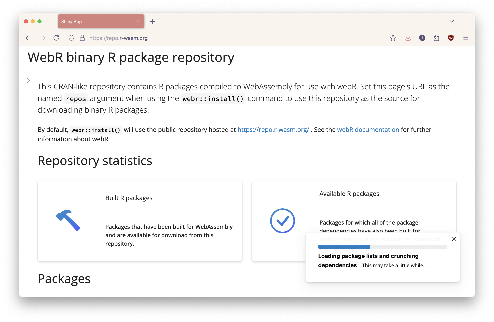

[repo.r-wasm.org](https://repo.r-wasm.org)
:::

::: {.column width="50%"}
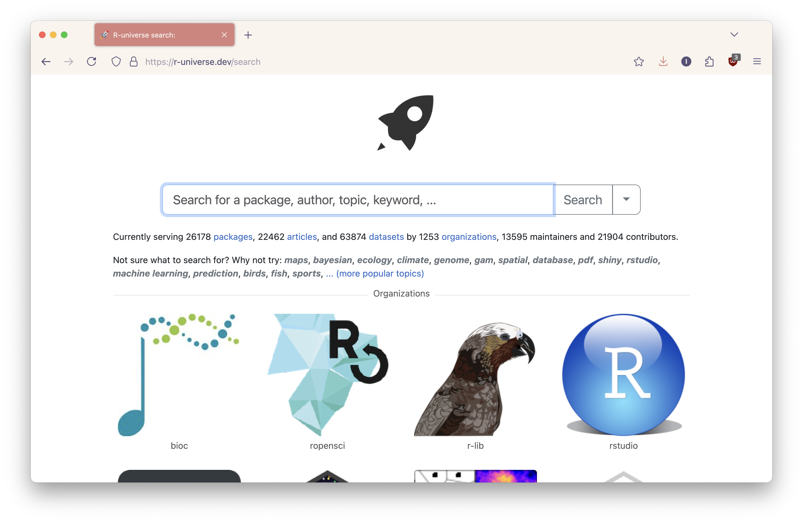

[R Universe](https://r-universe.dev/search)
:::
:::::

::: notes
Pyodide include a package manager that allows the use of over 1500 Python packages. It can also install Python wheels or load custom Python packages. There are over 14k R packages available for webR (not all have been tested). The way it works is that the R packages must be compiled for Wasm. By default, webr::install() will use the public repository hosted at https://repo.r-wasm.org/. R Universe is a project by rOpenSci that experiments with ideas for improving the publication and discover of research software in R. It builds Wasm binaries for R packages for use in webR applications. So for your custom R packages, the easiest wy to get up and running is to create a personal R-Universe repo for your packages. The system will automatically build R package binaries for different targets including WebAssembly, which can be used in webR or QuartoLive. There are other options, such as the rwasm package.
:::

## How to use webR

[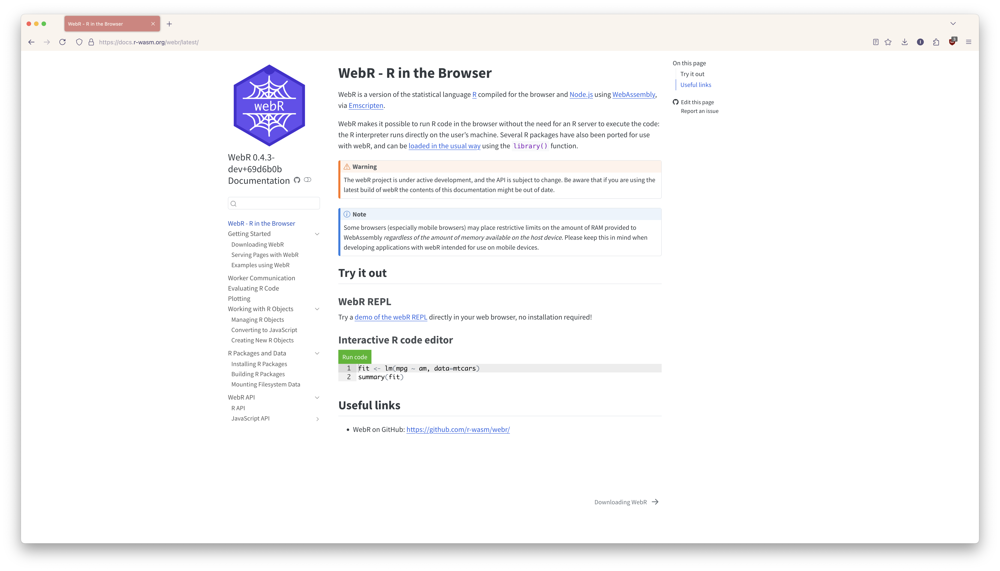{width="80%" fig-align="center"}](https://docs.r-wasm.org/webr/latest/)

::: aside
[https://docs.r-wasm.org/webr/latest/](https://docs.r-wasm.org/webr/latest/)
:::

## How to use webR

**Install the package:**

``` {.bash filename="Terminal"}
npm i webr
```

**Import the WebR class:**

``` {.js filename="JavaScript"}
import { WebR } from 'webr';

const webR = new WebR();
await webR.init();
```

. . .

What if you don't know JavaScript? 😅

::: notes
WebR aims to be as quick and easy to use as possible for those familiar with JavaScript web development, which raises the question... what if you don't know Javascript?
:::

##  {background-image="images/quartolive-intro.png"}

::: notes
Quarto Live allows you to embed WebAssembly-powered code blocks and exercises in Quarto documents through the quarto-live extension. There's support for both R via webR and Python via Pyodide. Featuers include interactive code blocks, exercises with hints and solutions, and rich output like plots. And most importantly, web development skills are not needed to use webR in your content. I wanted to mention that originally, there was Jame Balamuta's quarto-webr extension, but quarto-live is the version supported by Posit.
:::

## Introduction to Quarto Live

Quarto Live embeds WebAssembly powered code blocks and exercises for R and Python into Quarto documents with HTML-based output formats.

```{webr}
for (x in 1:5) {
  print(x ** 2)
}
```

::: notes
After a short loading period, a Run code button will appear. R and Python code can be edited and executed in an editor like this one. Let's run and edit this code as an example.
:::

## Example: Claus Wilke Introduction to R

[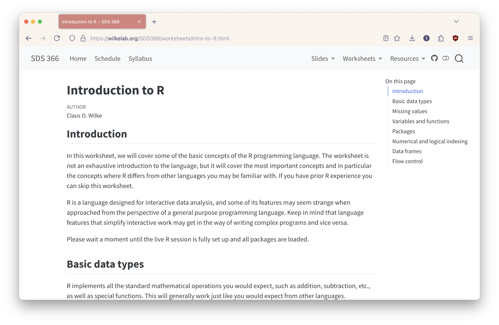{width="80%" fig-align="center"}](https://wilkelab.org/SDS366/worksheets/intro-to-R.html)

::: aside
[https://wilkelab.org/SDS366/worksheets/intro-to-R.html](https://wilkelab.org/SDS366/worksheets/intro-to-R.html)
:::

## Example: Six not-so-basic base R functions

[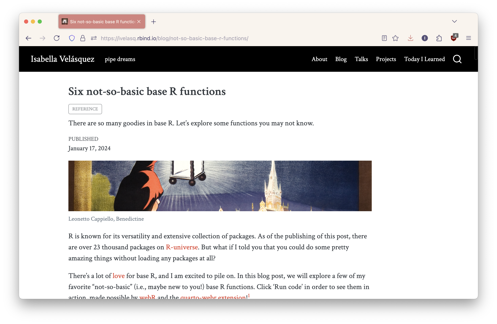{width="70%" fig-align="center"}](https://ivelasq.rbind.io/blog/not-so-basic-base-r-functions/)

::: aside
[https://ivelasq.rbind.io/blog/not-so-basic-base-r-functions/](https://ivelasq.rbind.io/blog/not-so-basic-base-r-functions/)
:::

## How to install Quarto Live {auto-animate="true"}

Install the extension:

``` {.bash filename="Terminal"}
quarto add r-wasm/quarto-live
```

Add to your Quarto document YAML header:

``` {.qmd filename="example.qmd"}
---
format: html
---
```

## How to install Quarto Live {auto-animate="true"}

Install the extension:

``` {.bash filename="Terminal"}
quarto add r-wasm/quarto-live
```

Add to your Quarto document YAML header:

``` {.qmd filename="example.qmd"}
---
format: live-html
engine: knitr
---

{}
```

## Installing packages

### As the document loads

``` {.qmd filename="example.qmd"}
---
format: live-html
webr:
  packages:
    - dplyr
    - palmerpenguins
    - ggplot2
---
```

## Installing packages

### Interactively

```` {.qmd filename="example.qmd"}
```{{webr}}
install.packages("dplyr", quiet = TRUE)
```
````

## How to use Quarto Live {.auto-animate}

- Place code in a `webr` code chunk for R
- Place code in a `pyodide` code chunk for Python

```` {.qmd filename="example.qmd"}
```{{webr}}
for (x in 1:5) {
  print(x ** 2)
}
```
````

## How to use Quarto Live {.auto-animate}

Can be used in presentations too:

- Edit your YAML header to `live-revealjs`:

``` {.qmd filename="example.qmd"}
---
format: live-revealjs
---
```

- Use the `quarto-drop` extension to drop an R or Python console into your slides

## How to use Quarto Live

Options include:

::: incremental
- Creating read-only cells
- Autorun
- Autocomplete
- and more!
:::

## Creating exercises

Designating a `webr` chunk as an exercise (with optional setup code, hints, solutions, and grading).

```{webr}
#| exercise: ex_1
# Fill in the blank so that the result of the sum is 10.

1 + 2 + 3 + ______
```

```{webr}
#| exercise: ex_1
#| check: true
if (identical(.result, 10)) {
  list(correct = TRUE, message = "Nice work!")
} else {
  list(correct = FALSE, message = "That's incorrect, sorry.")
}
```

:::: {.hint exercise="ex_1"}
::: {.callout-note collapse="false"}
## Hint 1

Consider subtracting 1, 2, and 3 from 10.
:::
::::

:::: {.solution exercise="ex_1"}
::: {.callout-tip collapse="false"}
The answer is 4 ☺️
:::
::::

## webR love 💜

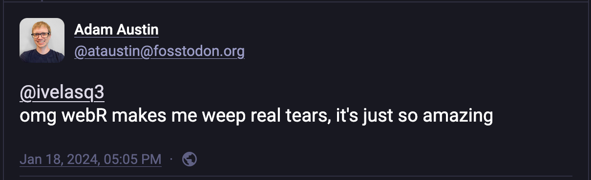{fig-align="center"}

## Quarto Live Reference

[Quarto Live Reference](../../quarto_live.qmd)

##  {background-image="images/shiny.png"}

## Web apps for statistics

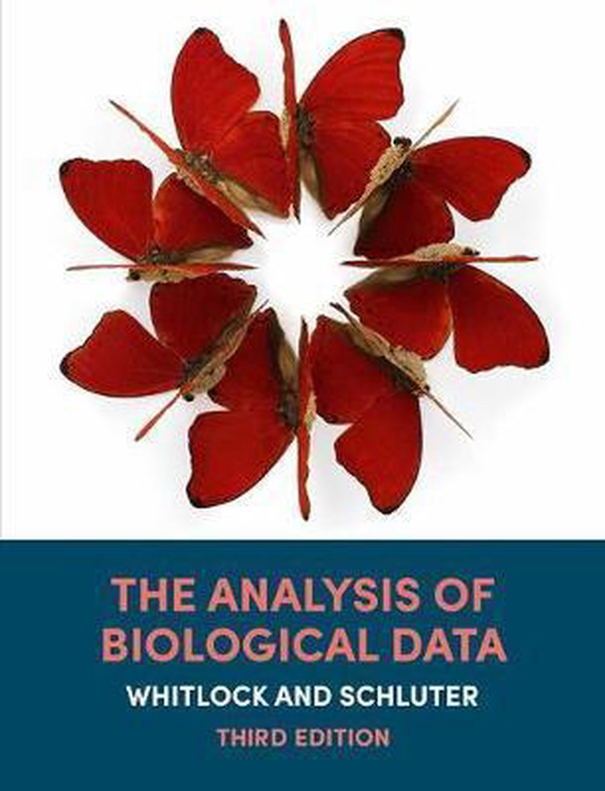{width="35%" fig-align="center"}

::: aside
[Visualizing statistics](https://www.zoology.ubc.ca/~whitlock/Kingfisher/KFhomepage.htm)
:::

## Introduction to Shiny

Shiny allows you to create web apps, no web development skills required.

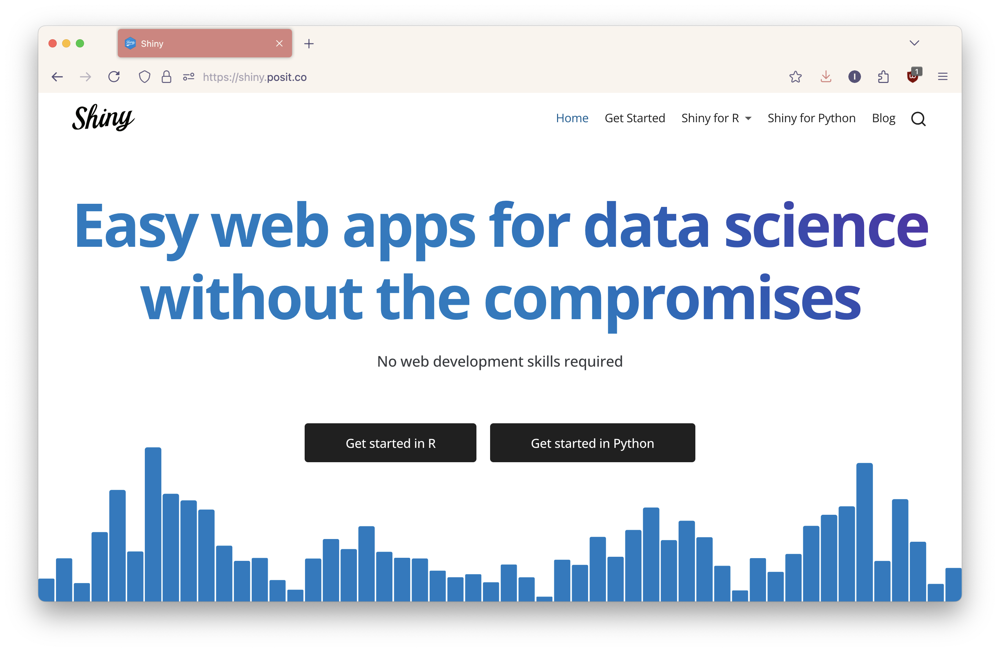{width="60%" fig-align="center"}

::: aside
[shiny.posit.co](https://shiny.posit.co/)
:::

## Traditional Shiny architecture

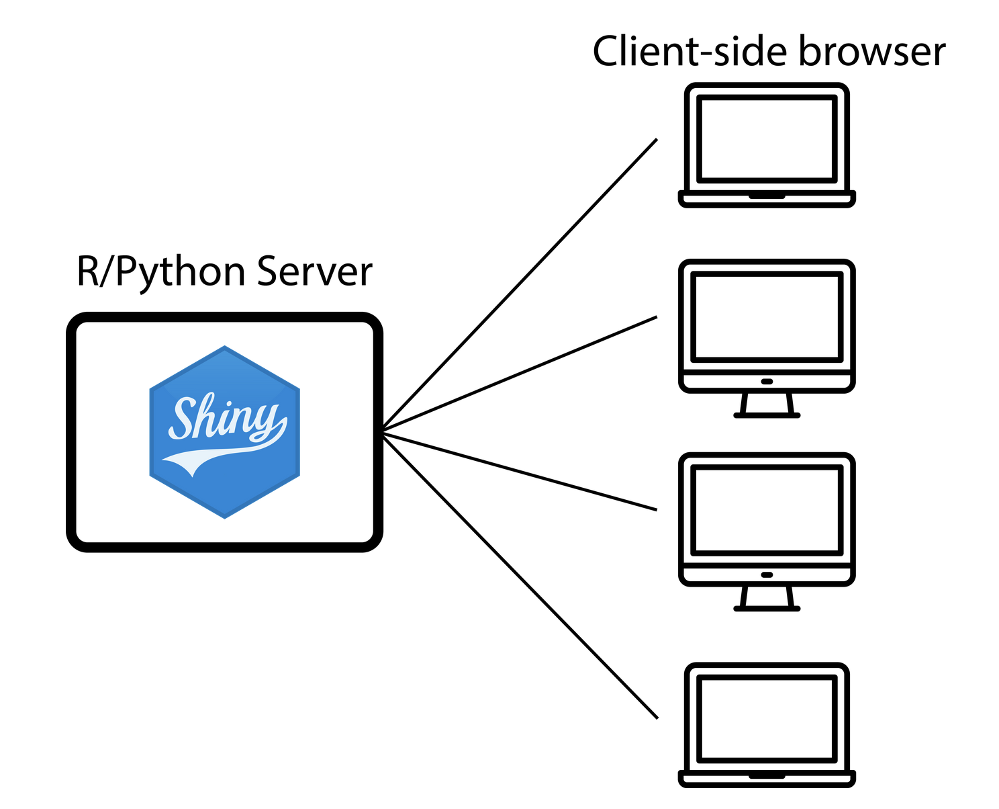{width="60%" fig-align="center"}

::: aside
[Source](https://georgestagg.github.io/shiny-without-a-server-2023/#/traditional-shiny-architecture)
:::

::: notes
The traditional way of deploying Shiny involves in a separate server and client. A server is a machine, connected to the Internet, that runs 24/7, ready to run your Shiny app. The server runs Python and Shiny, and clients connect via the web browser. Each client keeps an open websocket connection as long as they are using the application. This is of course a simplification of the process, but fundamentally, it looks like this.
:::

## Hosting Shiny apps

::::: columns
::: {.column width="60%"}
#### On-Prem

- [Shiny Server](https://shiny.posit.co/py/docs/deploy.html#deploy-to-shiny-server-open-source) (open source)
- [Roll your own](https://shiny.posit.co/py/docs/deploy.html#other-hosting-options)
:::

::: {.column width="40%"}
#### Cloud

- [Posit Connect Cloud](https://connect.posit.cloud/)
- [Hugging Face](https://huggingface.co/docs/hub/spaces-sdks-docker-shiny)
- [Roll your own](https://shiny.posit.co/py/docs/deploy.html#other-hosting-options)
:::
:::::

::: notes
There are options for hosting Shiny apps, i.e., hosting their syervers, you could have RStudio Server on your laptop. But say you need scalability or additional security for your app, you could pay Posit money to have them host your servers for you with Posit Connect. There are also cloud-based solutions like Posit Connect. There's a spectrum in terms of number of users, for some, it might just be a few people and for others, we're talking thousands. There are also some in between, such as academics. Professors might have a few hundred folks looking at their apps, but they don't have infrastructure or the resources to set it up.
:::

## Hosting Shiny apps

Some web services offer scalability, features, and cost:

- [GitHub Pages](https://pages.github.com/)
- [Netlify](https://www.netlify.com/)

. . .

But they can't run traditional Shiny apps!

::: notes
This is static web hosting. And it's great in terms of reach and affordabilty. You don't have to think about servers anymore, you just give them your app files. But, there's no way to run Shiny apps or dynamic R or Python code. If you've worked with Shiny in the past, you've probably embedded Shiny apps in an iFrame when you wanted to share them on a website.
:::

##  {background-image="images/shinylive.png"}

::: notes
With Shinylive, anybody can create their own serverless Shiny apps to run in the browser.
:::

## Example: Claus Wilke's Color Picker App

[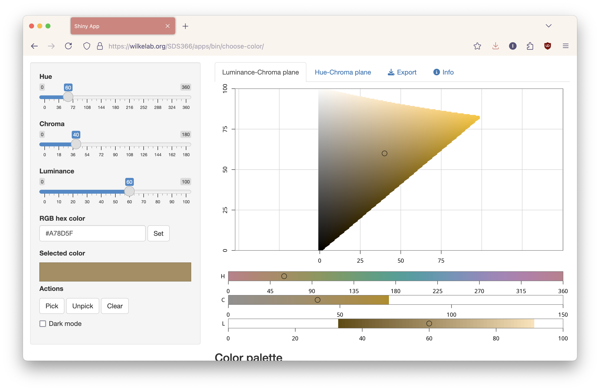{width="80%" fig-align="center"}](https://wilkelab.org/SDS366/apps/bin/choose-color/)

::: aside
[Link](https://wilkelab.org/SDS366/apps/bin/choose-color/)
:::

## Introduction to Shinylive

```{shinylive-r}
#| standalone: true
#| viewerHeight: 500

library(shiny)
library(bslib)

ui <- page_sidebar(
  title = "Simple Shiny App",
  theme = bs_theme(bootswatch = "flatly"),
  
  sidebar = sidebar(
    numericInput("number", "Enter a number:", value = 5, min = 1, max = 100),
    selectInput("color", "Choose color:", 
                choices = c("red", "blue", "green", "purple"))
  ),
  
  card(
    card_header("Result"),
    card_body(
      plotOutput("plot")
    )
  )
)

server <- function(input, output) {
  output$plot <- renderPlot({
    plot(1:input$number, 
         col = input$color,
         pch = 19,
         cex = 2,
         main = "Simple Plot",
         xlab = "Index",
         ylab = "Value")
  })
}

shinyApp(ui, server)
```

::: notes
Announced in July 2022 for Python and September 2023 for R, Shinylive uses Pyodide and webR to enable fully in-browser Shiny apps without a backend. It offers an online editor, conversion of existing Shiny apps, and embedding Shiny apps in Quarto documents.
:::

## Shinylive architecture

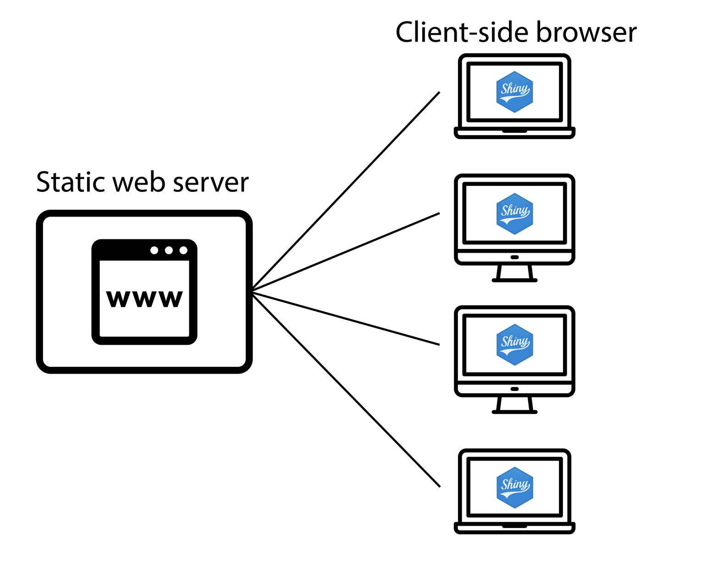{width="60%" fig-align="center"}

::: aside
[Source](https://georgestagg.github.io/shiny-without-a-server-2023/#/traditional-shiny-architecture)
:::

::: notes
All you need to run Shinylive is one of these static web servers. When an application is deployed with Shinylive, Python and Shiny run in the web browser: the browser is effectively both the client and server for the application. There is a web server that serves files, but it does not run Python or Shiny—it can be a “dumb” static web server.
:::

## How to use Shinylive

1.  Shinylive online editor
2.  Convert a Shiny app
3.  Embed a Shiny app with Quarto

## How to use Shinylive

### Shinylive online editor

[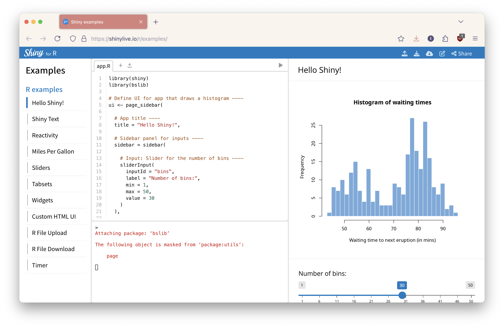{width="70%" fig-align="center"}](https://shinylive.io/r/examples/)

::: aside
[Link](https://shinylive.io/r/examples/)
:::

::: notes
There's an online Shinylive editor for R and Python. The editor is on the left, so you can change the app in real time. Build it live! It uses bslib which is next-generation Shiny creation and styling. It aims to look beautiful right out of the box. You can share apps via the share button, with a URL that you can sent to someone else.
:::

## How to use Shinylive

### Convert a Shiny app

Install the package:

``` r
install.packages("shinylive")
```

<br>

``` python
pip install shinylive
```

::: aside
[R docs](https://posit-dev.github.io/r-shinylive/)

[Python docs](https://shiny.posit.co/py/docs/shinylive.html)
:::

## How to use Shinylive

### Convert a Shiny app

Export the app:

``` r
shinylive::export("myapp", "site")
```

<br>

``` python
shinylive export myapp site
```

::: aside
[R docs](https://posit-dev.github.io/r-shinylive/)

[Python docs](https://shiny.posit.co/py/docs/shinylive.html)
:::

::: notes
Converting the app takes an app in the my app directory and produces an output directory site and then you can load the files to a static web hosting service.
:::

## How to use Shinylive

### Convert a Shiny app

Start a web server for the directory:

``` r
httpuv::runStaticServer("site")
```

<br>

``` python
cd site
python -m http.server 8000
```

::: aside
[R docs](https://posit-dev.github.io/r-shinylive/)

[Python docs](https://shiny.posit.co/py/docs/shinylive.html)
:::

::: notes
If you want to preview the app, you can run this and it'll open it up in a web browser.
:::

## How to use Shinylive

### Embed a Shiny app with Quarto

Install the Quarto extension:

``` {.bash filename="Terminal"}
quarto add quarto-ext/shinylive
```

Add to your Quarto document YAML heading:

``` {.qmd filename="example.qmd"}
filters:
  - shinylive
```

::: aside
[R docs](https://posit-dev.github.io/r-shinylive/)

[Python docs](https://quarto-ext.github.io/shinylive/)
:::

## How to use Shinylive

### Embed a Shiny app with Quarto

Insert a code block with `{shinylive-python}` or `{shinylive-r}`

```` {.qmd filename="example.qmd"}
```{{shinylive-python}}
#| standalone: true

/* App code here */

```
````

## Example: Shiny Assistant

[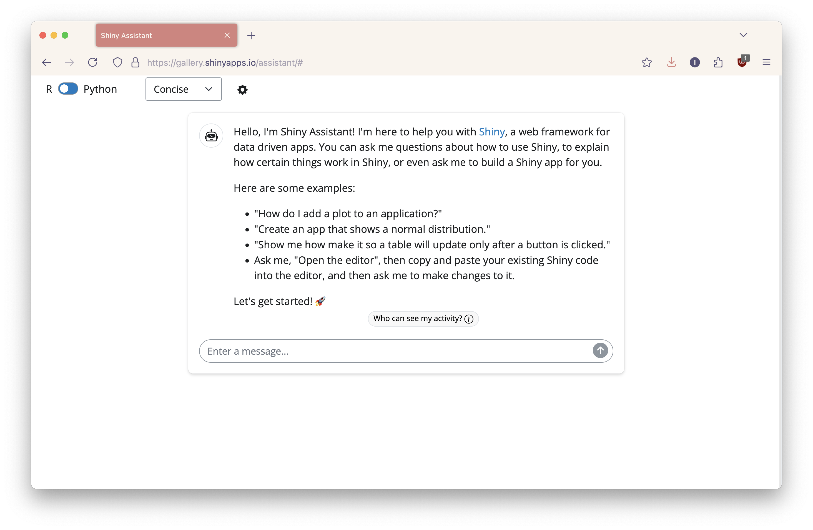{width="80%" fig-align="center"}](https://gallery.shinyapps.io/assistant/#)

::: aside
[Link](https://gallery.shinyapps.io/assistant/#)
:::

## Publishing

## Thank you

Slides borrowed heavily from [Isabella Velásquez](https://ivelasq.rbind.io/).

Reference Website: https://mdlama.github.io/oerquarto/

Slides: https://mdlama.github.io/oerquarto/slides/gateways-2026-tutorial

Questions?